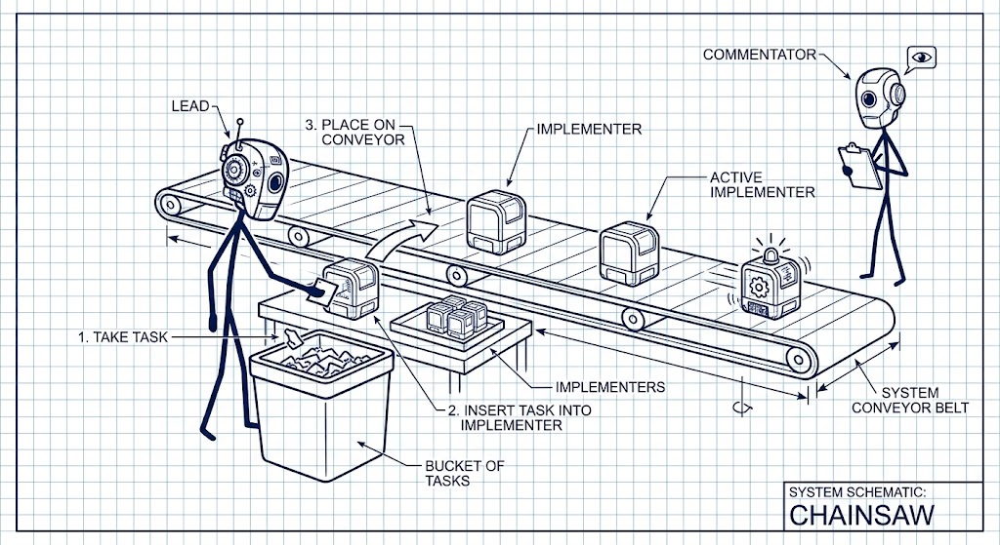

# Chainsaw

<p align="center">
  
</p>

A lead feeds tasks onto a conveyor of implementers. One is coding; the next is already reading. A commentator watches from the side and files findings. Planning and review stay off the belt so the coding sessions don't sit idle.

You run this inside [Herdr](https://herdr.dev). Install the skill, point an agent at a spec, and say **chainsaw this spec**.

```sh
npx skills add alexeyv/chainsaw
```
