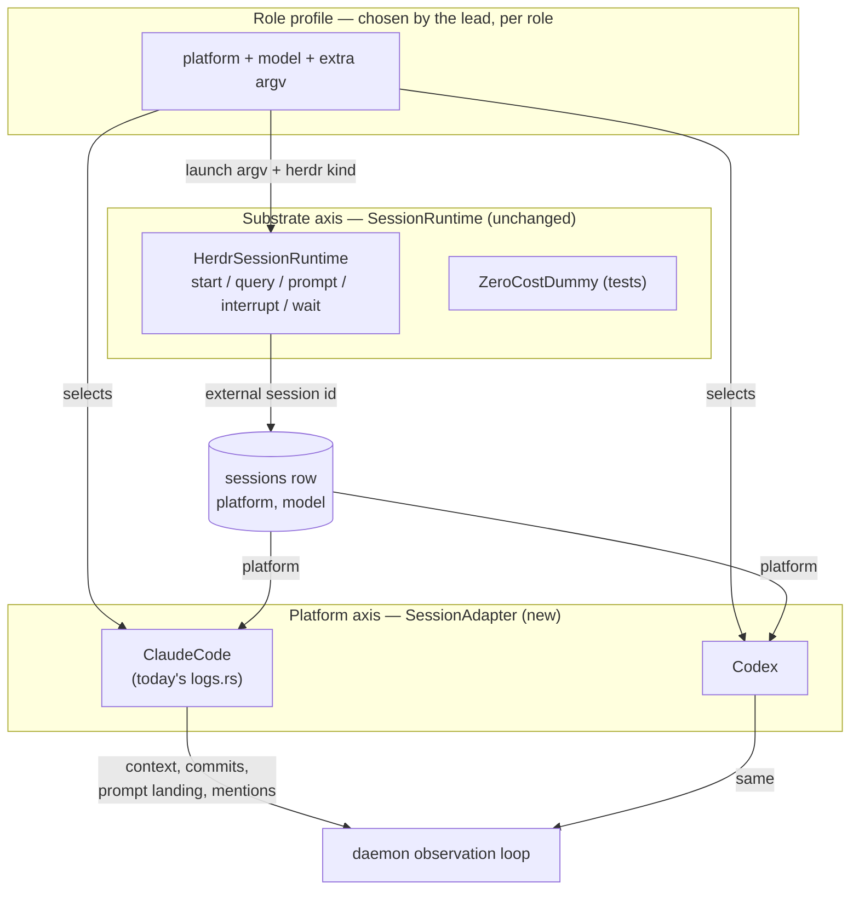
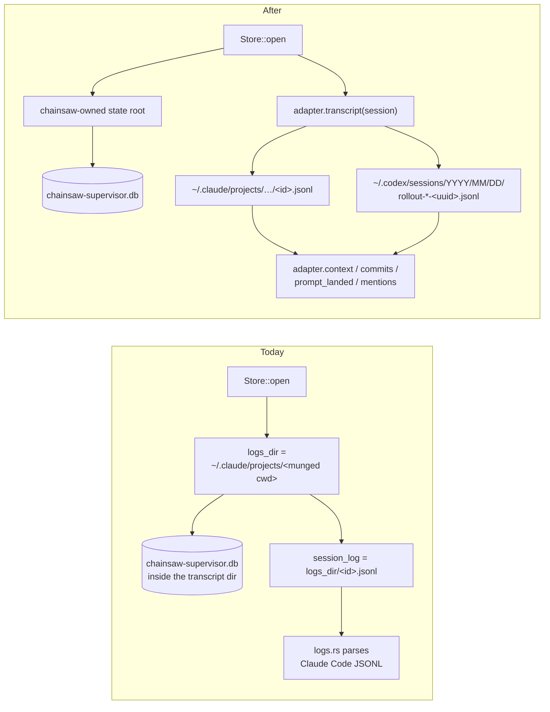

# Architecture diagrams

## Where the axes live



The launch flag flows left to right once; the persisted `platform` column is what lets the daemon re-enter the adapter on every later poll.

## Today vs after



The database moving out of the transcript directory is the change that unblocks everything else: there is no per-project Codex directory to put it in.

## A heterogeneous run

```mermaid
sequenceDiagram
  participant Human
  participant Lead as Lead (claude, fable)
  participant Sup as chainsaw
  participant Herdr
  participant Impl as Implementer (codex)
  participant Comm as Commentator (claude, opus)

  Human->>Lead: start session, invoke skill
  Lead->>Sup: daemon --lead … --platform claude
  Lead->>Sup: start-commentator --platform claude --model opus
  Lead->>Sup: launch worker-1 --platform codex --model gpt-5-codex
  Sup->>Herdr: agent start --kind codex -- -m gpt-5-codex …
  Herdr-->>Sup: external session id
  Sup->>Sup: persist platform=codex on the session row
  Lead->>Sup: dispatch task → prompt worker-1
  loop every poll
    Sup->>Impl: read rollout via Codex adapter
    Impl-->>Sup: commit sha, context, prompt landing
  end
  Sup->>Comm: commit <sha> landed for task N; review it from git
  Comm->>Sup: finding / observe / verdict
```

The commentator is Claude while the transcript it reviews is Codex — the case the adapter must make ordinary, by handing it resolved paths and naming the format rather than pointing at a directory.
